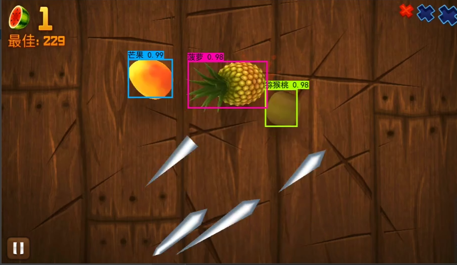

# AutoFruitCutting
通过yolo和scrcpy实现水果忍者自动检测切水果。

## 使用
下载Release中的yolo模型权重放置在model_data文件夹下(或者通过[https://github.com/bubbliiiing/yolov4-pytorch](https://github.com/bubbliiiing/yolov4-pytorch)自行训练模型，然后修改yolo.py中的权重路径)，在ForApp.py中配置手机或模拟器端口以及水果忍者的软件包名后运行即可。
## 依赖
*   **scrcpy** (scrcpy-win64-v3.1):
    *   **来源:** [https://github.com/Genymobile/scrcpy](https://github.com/Genymobile/scrcpy)
    *   **协议:** Apache License 2.0 (详情见 [LICENSE-APACHE](LICENSE-APACHE))
    *   本项目中对于 scrcpy-win64-v3.1 文件夹下的文件未做任何更改。
## Reference
https://github.com/bubbliiiing/yolov4-pytorch

https://github.com/Genymobile/scrcpy
